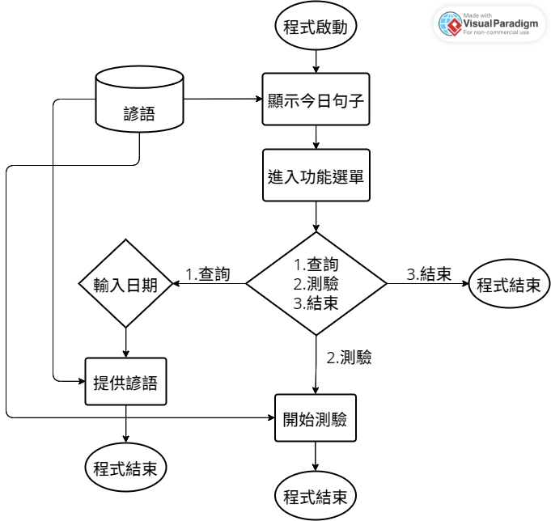
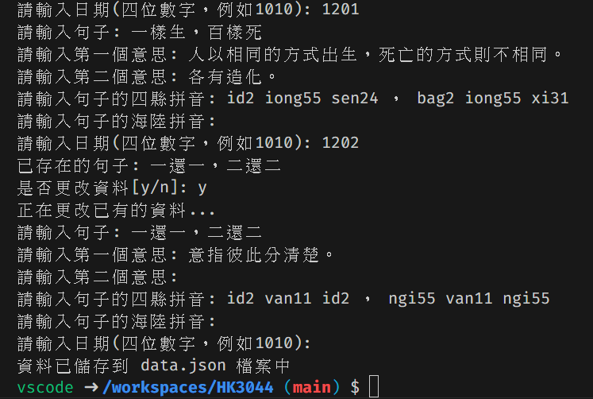
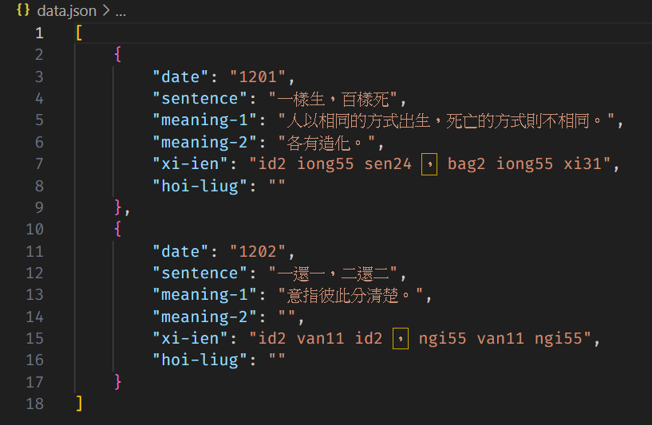

# HK3044
midterm and final homework 

## 預期功能
1. 原本預計的每日一句 
開啟程式後顯示今日日期與今日句子 
預計句子格式： 
句子 
四縣拼音： 
海陸拼音： 
 
要不要做圖片?

2. 查詢功能 
可查詢以前的句子(日期格式例：1023) 
需判斷輸入是否合法(數字)

3. 測驗功能 
分兩個，都可以選擇要考幾題，計算正確率

- 3-1考某段期間的句子 
考拼音可能比較簡單(避免字體問題)

- 3-2使用者自訂 
使用者自行輸入「詞」與「拼音」，進行測驗。

## input.py
提供建置資料庫(json檔)功能。 
提供新增資料以及更改舊有資料功能(以日期判斷) 
執行後可依序輸入：
1. 日期
2. 句子
3. 第一個意思
4. 第二個意思(如果有的話，無可以enter跳過)
5. 四縣拼音
6. 海陸拼音

功能範例圖片： 

## data.json
以json檔形式儲存檔案，以便後續程式讀取。 

## 其他內容

### excel檔
<https://1drv.ms/x/s!ArOy4OoXs3OkgYcV6ipe211rVkvL0Q?e=cAgmPB>

### 參考資料